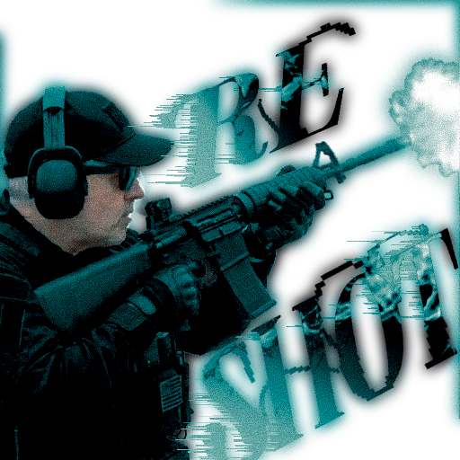

<div align="center">



# reshot

**Резидентная утилита скриншотов и записи экрана для Windows.**

Живёт в трее и не тратит ни такта, пока её не позвали.

[](LICENSE)
[](#системные-требования)
[](https://dotnet.microsoft.com/)

</div>

---

## Что это

Нажимаешь горячую клавишу — reshot **мгновенно замораживает все мониторы** одним кадром.
Выделяешь область любой формы, размечаешь её и отправляешь в буфер или в файл. Либо
записываешь выделенное в видео со звуком.

Главный принцип: **ноль нагрузки в фоне**. Ни таймеров, ни опроса — только ожидание
горячей клавиши. В простое это меньше 30 МБ памяти и ~0% процессора.

## Возможности

**Захват**

- Мгновенный снимок всех мониторов сразу, через Windows.Graphics.Capture
- Выделение формой: прямоугольник, эллипс, треугольник, лассо, полигон
- Несколько выделений одновременно (`Ctrl` + перетаскивание)
- За пределами непрямоугольной формы — прозрачность, в том числе в буфере обмена

**Разметка**

- Кисть, фигуры, линии и стрелки, текст
- Блюр и пикселизация с настраиваемой силой
- Три ластика: обычный, абсолютный (до прозрачности) и для фильтров
- Мягкое стирание в духе Photoshop: центр всегда на 100%, край — по настройке
- Пипетка, полная HSV-палитра, 16 своотчей
- История на 32 шага
- У каждого инструмента свои размер, непрозрачность и цвет

**Текст с картинки (OCR)**

- Распознавание встроенным движком Windows: офлайн, без моделей и без сети
- Слова становятся выделяемыми прямо поверх кадра — тянешь мышью и копируешь
- Режим AUTO гоняет русский и английский движки и склеивает результат построчно,
  потому что один движок Windows OCR коверкает чужой алфавит

**Запись**

- MP4 / H.264 с аппаратным кодированием (NVENC, AMF, QSV)
- Запись области любой формы, а не только прямоугольника
- Системный звук и микрофон пишутся **раздельно**, поэтому дорожки выбираются
  уже после остановки записи
- Звук отдельных приложений через Windows Process Loopback
- Отдельный диктофон для записи только звука

**Оболочка**

- Радиальное меню по удержанию горячей клавиши: быстрая запись экрана, быстрый
  диктофон, настройки
- Оформление в духе Half-Life 2 / Source VGUI
- Настройки, автозапуск, single instance

## Установка

Готовые сборки — на странице [Releases](https://github.com/reteren/reshot/releases).

| Файл | Что это |
|---|---|
| `reshot-<версия>-setup.exe` | Установщик. Ставится в профиль пользователя, без прав администратора |
| `reshot-<версия>-win-x64-portable.zip` | Портативная версия: распакуй и запусти `reshot.exe` |

Среда .NET не нужна: сборка self-contained.

> Приложение не подписано сертификатом, поэтому при первом запуске SmartScreen может
> предупредить. Это ожидаемо: «Подробнее» → «Выполнить в любом случае». Проверить
> целостность файла можно по `SHA256SUMS.txt` из релиза.

## Системные требования

- Windows 10 версии 2004 (сборка 19041) или новее, x64
- Для записи звука отдельных приложений — Windows 11
- Для распознавания русского текста — языковой пакет OCR
  («Параметры» → «Язык» → «Русский» → «Компоненты» → «Распознавание текста»)
- Мониторы с разным масштабированием DPI не поддерживаются

## Как пользоваться

По умолчанию горячая клавиша — `Home`, перебиндивается в настройках.

| Действие | Что происходит |
|---|---|
| Короткое нажатие | Экран замирает, начинается сессия захвата |
| Удержание | Радиальное меню: быстрая запись, диктофон, настройки |
| Во время записи | Останавливает запись и сохраняет файл |

Инструменты переключаются цифрами `1`–`0` по порядку тулбара. Полный список сочетаний —
во вкладке **Info** окна настроек; она обновляется вместе с кодом.

## Сборка из исходников

Нужны [.NET 8 SDK](https://dotnet.microsoft.com/download), [Node.js 18+](https://nodejs.org/)
и [Rust](https://rustup.rs/) (последние два — только для окна настроек).

```powershell
dotnet build reshot.sln -c Debug          # собрать решение
dotnet test                               # прогнать тесты ядра
dotnet run --project src/Reshot.App       # запустить (свернётся в трей)
```

Окно настроек — отдельное приложение на Tauri:

```powershell
npm install --prefix src/reshot-tauri
npm run tauri build --prefix src/reshot-tauri -- --no-bundle
```

> Собирать настройки нужно именно так. Обычный `cargo build` даёт **dev**-бинарник,
> который тянет интерфейс с локального dev-сервера и без него показывает пустую страницу.

Все артефакты релиза (портативный архив, установщик, контрольные суммы) собирает один
скрипт — подробности в [build/README.md](build/README.md):

```powershell
pwsh build/build-release.ps1
```

## Устройство

| Проект | Назначение |
|---|---|
| `src/Reshot.App` | WPF-оболочка: трей, хоткеи, оверлей, OCR, экспорт |
| `src/Reshot.Core` | Ядро без UI: модель документа, история, настройки, хоткеи |
| `src/Reshot.Capture` | Обёртка Windows.Graphics.Capture (кадр и живой поток) |
| `src/Reshot.Recording` | MP4 и M4A через Media Foundation и NAudio, без ffmpeg |
| `src/reshot-tauri` | Окно настроек: Tauri 2, Rust, TypeScript |
| `tests/Reshot.Core.Tests` | Юнит-тесты ядра (xUnit) |

Подробнее: [ARCHITECTURE.md](ARCHITECTURE.md) — стек и обоснование решений,
[SPEC.md](SPEC.md) — функциональная спецификация, [ROADMAP.md](ROADMAP.md) — план по фазам.

## Лицензия

[MIT](LICENSE).
